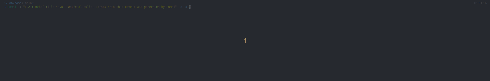

# Comai - Commit Message AI

Comai is a command-line tool that helps you generate informative and relevant commit messages for your Git repositories using GPT-4 by OpenAI. It analyzes your staged changes and creates a commit message based on the diff, saving you time and effort while maintaining meaningful commit history.



# Prerequisites

- Go 1.20 or later
- An OpenAI API key (get one at https://beta.openai.com/signup/)

## Installation

1. Clone the repository:

```bash
git clone https://github.com/yourusername/comai.git
```

2. Change to the project directory:

```bash
cd comai
```

3. Run the installation script:

```bash
chmod +x install.sh && ./install.sh
```

The install.sh script will build and install the comai binary to /usr/local/bin. If prompted for your password, enter it to grant sudo access.

# Configuration

Before using Comai, you need to set the **OPENAI_API_KEY** environment variable to your OpenAI API key. You can set this variable in your shell's configuration file (e.g., .bashrc for Bash or .zshrc for Zsh).

For example, add the following line to your shell configuration file, replacing your_api_key with your actual API key:

```bash
export OPENAI_API_KEY="your_api_key"
```

Then, reload your shell configuration:

```bash
source ~/.bashrc # For Bash
source ~/.zshrc # For Zsh
```

## Usage

After staging your changes using git add, run the comai command:

```bash
comai
```

To stage all changes before generating the commit message, use the -a or --add flag:

```bash
comai -a
```

Comai will generate a commit message based on your staged changes and display it. If you are satisfied with the generated message, run the following command to create the commit:

```bash
git commit -m "<generated commit message>"
```

Alternatively, you can use the -c or --commit flag to automatically create the commit with the generated message:

```bash
comai -c
```

If you want to use a specific template for your commit messages, you can set the **TEMPLATE_COMMIT** environment variable in your shell configuration file or pass it as a command-line argument using the -t or --template flag:

```bash
comai --template "My custom template: {message}"
```

To use a different engine model, you can use the -m or --model flag, with the default value set to "gpt-4":

```bash
comai --model "gpt-3"
```

## Contributing

We welcome contributions to the Comai project! Please feel free to submit issues, feature requests, or pull requests.

## License

This project is released under the MIT License.
