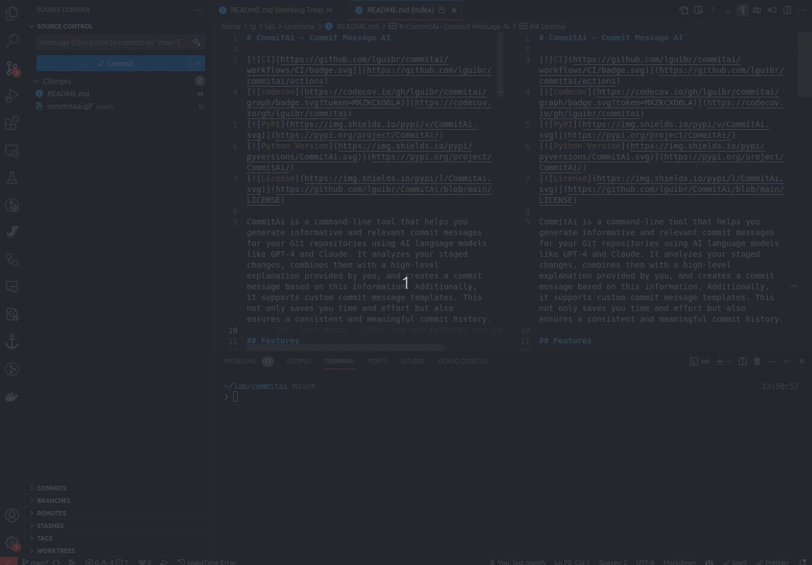

# CommitAi - Your AI-Powered Commit Assistant

[](https://github.com/lguibr/commitai/actions/workflows/main.yml)
[](https://codecov.io/gh/lguibr/commitai) <!-- Added Codecov Badge -->
[](https://pypi.org/project/CommitAi/)
[](https://pypi.org/project/CommitAi/)
[](https://github.com/lguibr/CommitAi/blob/main/LICENSE)
[](https://github.com/astral-sh/ruff)

<p align="center">
  
</p>

**Tired of writing Git commit messages? Let AI do the heavy lifting!**

**CommitAi** streamlines your Git workflow by leveraging powerful AI models (OpenAI's GPT, Anthropic's Claude, Google's Gemini) to automatically generate clear, concise, and conventional commit messages based on your staged changes.

Simply stage your files and run `commitai`. It analyzes the diff, optionally takes your high-level explanation, and crafts a commit message adhering to the [Conventional Commits](https://www.conventionalcommits.org/) standard. Review the message in your default Git editor, make any tweaks, save, and you're done!

## Table of Contents

- [CommitAi - Your AI-Powered Commit Assistant](#commitai---your-ai-powered-commit-assistant)
  - [Table of Contents](#table-of-contents)
  - [Features](#features)
  - [Demo](#demo)
  - [Installation](#installation)
  - [Configuration](#configuration)
    - [API Keys](#api-keys)
    - [Commit Templates (Optional)](#commit-templates-optional)
  - [Usage](#usage)
    - [Basic Workflow](#basic-workflow)
    - [Command-Line Options](#command-line-options)
    - [Creating Repository Templates](#creating-repository-templates)
  - [Examples](#examples)
  - [Contributing](#contributing)
  - [License](#license)

## Features

*   🧠 **Intelligent Commit Generation**: Analyzes staged code differences (`git diff --staged`) using state-of-the-art AI models (GPT, Claude, Gemini) to create meaningful commit messages.
*   📄 **Conventional Commits**: Automatically formats messages according to the Conventional Commits specification (e.g., `feat(auth): add JWT authentication`). This improves readability and enables automated changelog generation.
*   📝 **Optional Explanations**: Provide a high-level description of your changes as input to guide the AI, or let it infer the context solely from the code diff.
*   ✅ **Pre-commit Hook Integration**: Automatically runs your existing native Git pre-commit hook (`.git/hooks/pre-commit`) before generating the message, ensuring code quality and style checks pass.
*   🔧 **Customizable Prompts via Templates**: Add custom instructions or context to the AI prompt using global environment variables or repository-specific template files.
*   🤖 **Multiple AI Provider Support**: Choose your preferred AI model from OpenAI, Anthropic, or Google.
*   ⚙️ **Flexible Workflow**:
    *   Stages all changes automatically (`-a` flag).
    *   Reviews message in your default Git editor (default behavior).
    *   Commits directly without editor review (`-c` flag).
*   ✨ **Modern Tooling**: Built with `pyproject.toml` and formatted/linted with `ruff`.

## Demo



*(Demo shows generating a commit message using Claude 3 Opus without providing an explicit explanation)*

## Installation

Ensure you have Python 3.8+ and Git installed.

Install **CommitAi** directly from PyPI:

```bash
pip install commitai
```

## Configuration

### API Keys

CommitAi requires API keys for the AI provider you intend to use. Set these as environment variables:

*   **OpenAI (GPT models):**
    ```bash
    export OPENAI_API_KEY="your_openai_api_key_here"
    ```

*   **Anthropic (Claude models):**
    ```bash
    export ANTHROPIC_API_KEY="your_anthropic_api_key_here"
    ```

*   **Google (Gemini models):**
    Set **one** of the following (CommitAi checks in this priority order):
    1.  `GOOGLE_API_KEY` (Recommended)
    2.  `GEMINI_API_KEY`
    3.  `GOOGLE_GENERATIVE_AI_API_KEY`

    Example:
    ```bash
    export GOOGLE_API_KEY="your_google_api_key_here"
    ```

You only need to set the key for the provider corresponding to the model you select (or the default, Gemini).

### Commit Templates (Optional)

You can add custom instructions to the default system prompt used by the AI. This is useful for enforcing project-specific guidelines (e.g., mentioning ticket numbers).

*   **Global Template:** Set an environment variable. This applies to all repositories unless overridden locally.
    ```bash
    # Example: Always ask the AI to reference a JIRA ticket format
    export TEMPLATE_COMMIT="Ensure the commit footer includes a JIRA reference like 'Refs: PROJECT-123'."
    ```

*   **Repository-Specific Template:** Use the `commitai-create-template` command within your repository. This creates a `.git/commit_template.txt` file and overrides the global `TEMPLATE_COMMIT` variable for this repo only.
    ```bash
    # Example: Instruct the AI to focus on UI changes for this specific repo
    commitai-create-template "Focus the commit message body on user-facing UI changes."
    ```

**Note:** These templates *add* to the default system prompt, which already instructs the AI to follow Conventional Commits format. You are providing supplementary instructions.

## Usage

### Basic Workflow

1.  **Make your code changes.**
2.  **Stage the changes** you want to include in the commit:
    ```bash
    git add <file1> <file2> ...
    # or stage all changes in tracked files
    git add .
    # or stage all changes including untracked files
    git add --all
    ```
3.  **Run `commitai`:**
    ```bash
    # Option 1: Let CommitAi infer the message from the diff
    commitai

    # Option 2: Provide a high-level explanation to guide the AI
    commitai "Refactor user authentication to use JWT tokens"
    ```
4.  **Review & Edit:** CommitAi runs pre-commit hooks, generates the message, and opens it in your default Git editor (e.g., Vim, Nano, VS Code). Review the message, make any necessary edits.
5.  **Save & Close:** Save the file and close the editor. CommitAi will then create the commit with the final message. If you close without saving or clear the message, the commit will be aborted.

### Command-Line Options

The `commitai` command (which is an alias for `commitai generate`) accepts the following options:

*   `-a`, `--add`:
    *   Automatically stages *all* unstaged changes (`git add --all`) before generating the commit message.
    *   Useful for quickly committing everything in the working directory.
    *   Example: `commitai -a "Implement user profile page"`

*   `-c`, `--commit`:
    *   Skips opening the Git editor for review. The generated message is used to create the commit directly.
    *   **Use with caution!** Reviewing AI-generated messages is recommended.
    *   Example: `commitai -c "Fix typo in documentation"` (for minor changes)
    *   Can be combined with `-a`: `commitai -a -c "Quick fix and commit all"`

*   `-m <model_name>`, `--model <model_name>`:
    *   Specifies which AI model to use.
    *   Defaults to `gemini-2.5-pro-preview-03-25`.
    *   Ensure the corresponding API key environment variable is set.
    *   Examples:
        *   `commitai -m gpt-4 "Use OpenAI's GPT-4"`
        *   `commitai -m claude-3-opus-20240229 "Use Anthropic's Claude 3 Opus"`
        *   `commitai -m gemini-2.5-flash-preview-04-17 "Use Google's Gemini 1.5 Flash"`

### Creating Repository Templates

The `commitai-create-template` command sets a repository-specific template instruction.

```bash
commitai-create-template "Add a 'Co-authored-by:' line if applicable."
```

This creates/overwrites the `.git/commit_template.txt` file in the current repository.

## Examples

**1. Simple commit, inferred message:**

```bash
# Stage changes
git add src/utils.py tests/test_utils.py

# Run commitai - AI infers message from diff
commitai
```
*(Editor opens with a message like `feat(utils): add helper function for data validation`)*

**2. Commit with explanation:**

```bash
# Stage changes
git add src/auth.py

# Run commitai with explanation
commitai "Implement password reset functionality using email tokens"
```
*(Editor opens with a message like `feat(auth): implement password reset via email token`)*

**3. Stage all and commit directly (no editor):**

```bash
# Stage all changes and commit immediately using GPT-4
commitai -a -c -m gpt-4 "Minor refactoring and cleanup"
```
*(Commit is created directly)*

**4. Using a Template:**

*   First, set a template:
    ```bash
    commitai-create-template "Mention the related issue number from GitHub, e.g., Fixes #123."
    ```
*   Then, run commitai:
    ```bash
    git add src/parser.py
    commitai "Fix bug in CSV parsing logic"
    ```
*(Editor opens with a message potentially like `fix(parser): correct handling of quoted commas\n\nFixes #123`)*

## Contributing

Contributions are highly welcome! Please follow these steps:

1.  Fork the repository on GitHub.
2.  Clone your fork locally: `git clone <your-fork-url>`
3.  Navigate to the project directory: `cd commitai`
4.  Create a virtual environment: `python -m venv .venv && source .venv/bin/activate` (or `.\.venv\Scripts\activate` on Windows)
5.  Install dependencies, including development tools: `pip install -e ".[test]"`
6.  **(Optional but Recommended)** Set up pre-commit hooks: `pre-commit install`
7.  Create a new branch for your feature or bug fix: `git checkout -b my-feature-branch`
8.  Make your changes.
9.  Run checks locally before committing:
    *   Format code: `ruff format .`
    *   Lint code: `ruff check .`
    *   Run type checks: `mypy commitai commitai/tests`
    *   Run tests: `pytest`
10. Commit your changes (you can use `commitai`!).
11. Push your branch to your fork: `git push origin my-feature-branch`
12. Open a pull request on the main `lguibr/commitai` repository.

The CI pipeline will automatically run all checks on your pull request.

## License

**CommitAi** is open-source software licensed under the MIT License. See the [LICENSE](https://github.com/lguibr/CommitAi/blob/main/LICENSE) file for more details.
